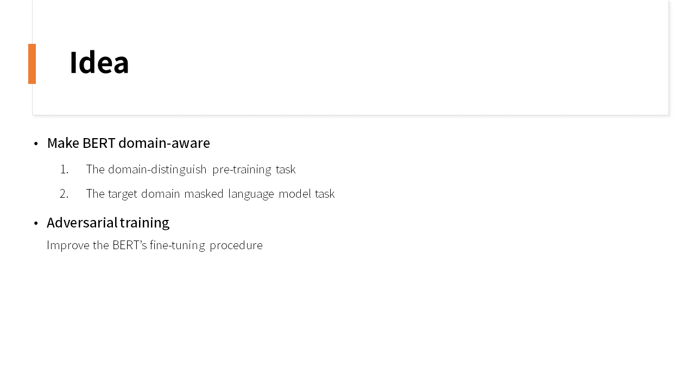
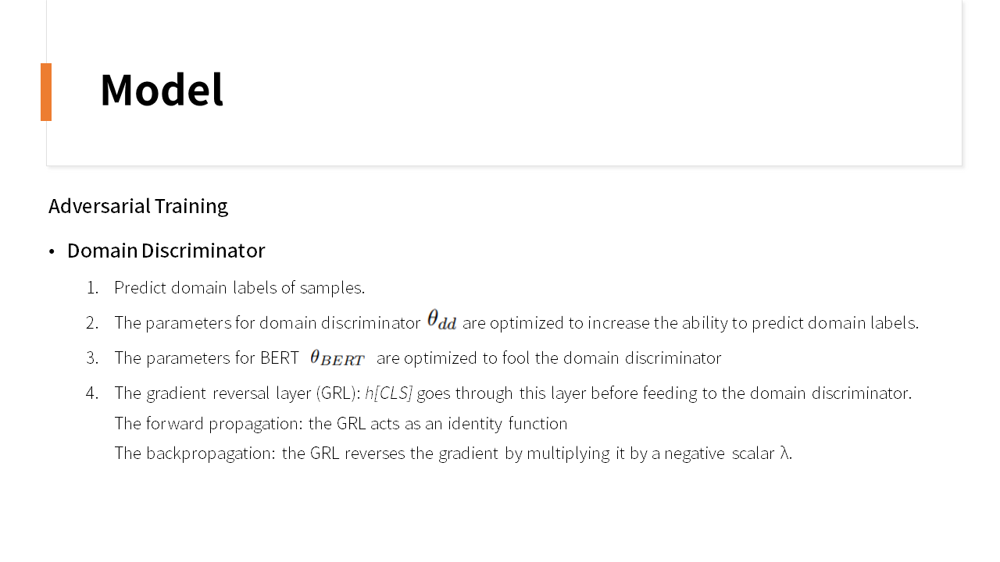

# BERT-Post-Training

나홀로 논문 스터디: [Adversarial and Domain-Aware BERT for Cross-Domain Sentiment Analysis][paper link], 그리고 나름대로의 구현

[paper link]: https://www.aclweb.org/anthology/2020.acl-main.370/

Studying about the paper [Adversarial and Domain-Aware BERT for Cross-Domain Sentiment Analysis][paper link] and implementing the proposed idea using Pytorch

## Study PPT
### Introduction

   
### Idea
   
### Model

     
### Experiments

   
